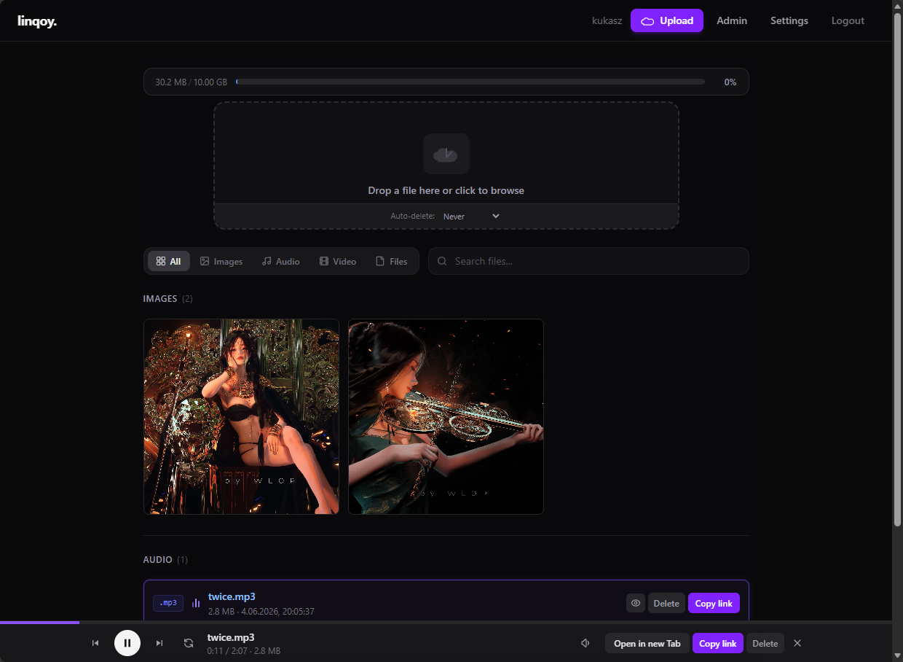

# linqoy

A file sharing app with a clean interface and zero clutter. Upload, share, manage — that's it.

**Live:** [app.linqoy.com](https://app.linqoy.com) · **Self-host:** clone from GitHub and run with Docker



---

## What linqoy. can do

- **Drag & drop to upload** — small files go in one request, big files are automatically split into chunks. The only limit is your storage quota.
- **ShareX ready** — one-click config. Screenshot → upload → link.
- **Public or private files** — keep stuff to yourself or share a link with anyone.
- **Auto-expiring uploads** — set files to disappear after a few days if you want.
- **Image gallery & file previews** — browse images in a lightbox, preview markdown and text files right in the browser.
- **Admin panel** — manage users, check analytics, configure storage, and run backups. Full control, zero fuss.
- **Storage quotas** — each user gets a limit, and they can see how much they've used.

Under the hood it covers the basics you'd expect: JWT logins, rate limiting, automatic backups, and HTTPS via Caddy.

---

## How it's built

- **Backend:** Node + Fastify + TypeScript, SQLite for the database
- **Frontend:** Next.js + React + Tailwind CSS
- **Everything runs in Docker** with Caddy handling HTTPS

You can store files on the local disk or any SUPPORTED storage provider.

---

## Getting started

```bash
git clone https://github.com/lukasdevit/linqoy.git
cd linqoy
cp .env.example .env   # fill in your secrets
docker compose -f docker-compose.dev.yml up -d
```

The frontend will be at [localhost:3001](http://localhost:3001), API at [localhost:3000](http://localhost:3000). Hot reload on both.

**Local dev without Docker:**
```bash
npm run dev          # backend only (localhost:3000)
npm run dev:all      # backend + frontend
npm test             # all tests
```

**Production:** `docker compose up -d`. Before deploying:
- Change the default admin password in `.env`
- Set `DOMAIN` to your real domain for HTTPS via Caddy
- Configure storage backend via Admin Panel → Storage (local or B2)

Push to `main` and CI/CD runs tests, tags a release, and deploys.

---

## License

MIT — do whatever you want with it.
